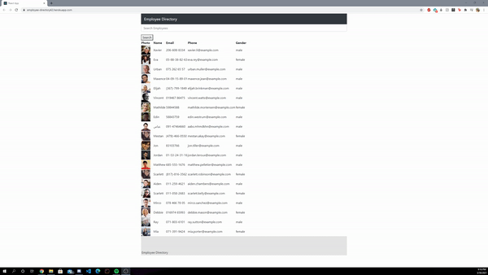

# Employee Directory



## Introduction

Have the user be able find employees in their workplace using a directory (Employees are randomly generated). 

## How to Install

Run ```npm i``` or ```npm install```

STEP 2:

Run ``` npm start ```
